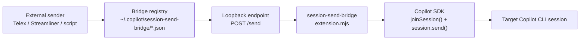
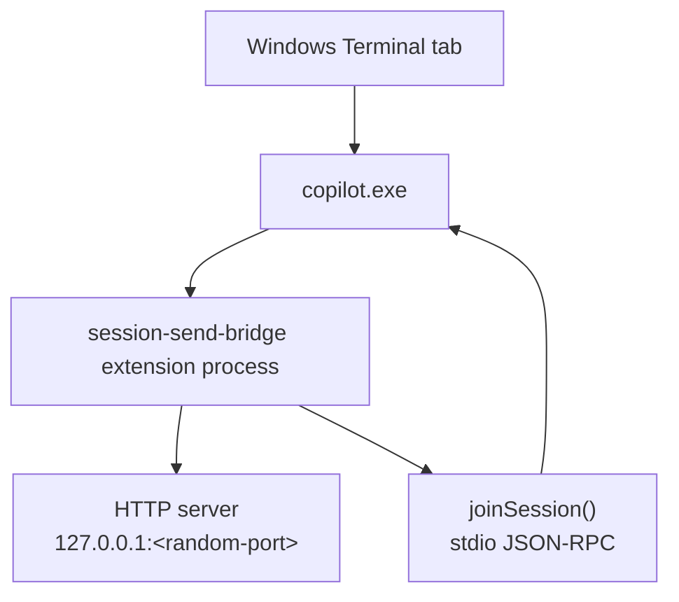
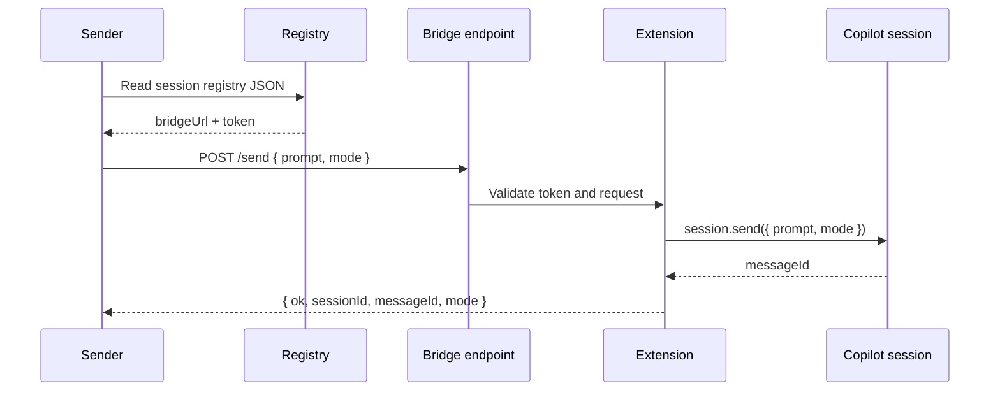
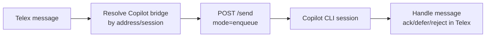

# Copilot Session Bridge

Copilot Session Bridge is a **GitHub Copilot CLI extension** that makes active Copilot CLI sessions externally messageable over a local loopback endpoint.

It exposes a small authenticated HTTP bridge per Copilot session and forwards inbound messages to that session with:

```js
session.send({ prompt, mode });
```

For the wire contract and automation-facing details, see [`docs/protocol.md`](docs/protocol.md).

## Concept

An active Copilot CLI session is not normally addressable from another process. A session ID tells you which conversation exists, and a PID tells you which process is alive, but neither gives you a safe way to inject a new message into the agent loop.

Copilot CLI extensions solve that by running **inside** the session. Once loaded, this extension gets a live `session` object from the Copilot SDK. It then exposes a local `127.0.0.1` endpoint so trusted local tools can ask the extension to enqueue a message into that same session.

In short:

```text
outside process -> local bridge -> Copilot SDK session.send() -> target Copilot session
```

## Architecture





## Install as a user extension

```powershell
git clone https://github.com/namra98/copilot-session-bridge.git
cd copilot-session-bridge
.\scripts\Install-UserExtension.ps1
```

This installs:

```text
~/.copilot/extensions/session-send-bridge/extension.mjs
```

Restart Copilot CLI sessions or reload extensions after installing.

## Install as a project extension

Copy the extension into a repository:

```text
<repo>/.github/extensions/session-send-bridge/extension.mjs
```

Use this when only sessions in that repository should load the bridge.

## How it works

When a Copilot CLI session loads the extension:

1. Copilot CLI starts `extension.mjs` as a child process.
2. The extension calls `joinSession()` and attaches to that session.
3. The extension starts a loopback server on `127.0.0.1`.
4. The extension writes a registry file under `~/.copilot/session-send-bridge/`.
5. External tools read the registry and POST messages to `/send`.
6. The extension calls `session.send({ prompt, mode })`.



## Discover bridge-enabled sessions

```powershell
Get-ChildItem "$HOME\.copilot\session-send-bridge\*.json" |
  ForEach-Object { Get-Content $_.FullName -Raw | ConvertFrom-Json } |
  Format-Table sessionId, bridgeUrl, pid, createdAt
```

Example registry entry:

```json
{
  "sessionId": "a9f2ecd2-dc6e-4a0c-b795-02882c616b1b",
  "bridgeUrl": "http://127.0.0.1:59518/send",
  "healthUrl": "http://127.0.0.1:59518/health",
  "token": "...",
  "pid": 65460,
  "createdAt": "2026-06-30T17:37:36.000Z"
}
```

## Send a message

Use the helper:

```powershell
.\scripts\Send-BridgeMessage.ps1 `
  -SessionId "<session-id>" `
  -Prompt "[EXTERNAL_MESSAGE] hello" `
  -Mode enqueue
```

Or call the bridge directly:

```powershell
$j = Get-Content "$HOME\.copilot\session-send-bridge\<sessionId>.json" -Raw | ConvertFrom-Json

Invoke-RestMethod `
  -Method Post `
  -Uri $j.bridgeUrl `
  -Headers @{ Authorization = "Bearer $($j.token)" } `
  -ContentType "application/json" `
  -Body (@{
    prompt = "[EXTERNAL_MESSAGE] hello"
    mode = "enqueue"
  } | ConvertTo-Json)
```

Expected response:

```json
{
  "ok": true,
  "sessionId": "a9f2ecd2-dc6e-4a0c-b795-02882c616b1b",
  "messageId": "bd93817b-92c9-4f6a-8434-e57b42c6c5c0",
  "mode": "enqueue"
}
```

## Bridge info tool

The extension registers a Copilot tool:

```text
session_send_bridge_info
```

Ask the target Copilot session to call it when you want the session to print its active bridge URL and registry path.

## Delivery modes

| Mode | Meaning | Use |
|---|---|---|
| `enqueue` | Add the message to the normal session queue. | Default |
| `immediate` | Interject during an in-progress turn. | Intentional interrupts only |

Use `enqueue` unless you deliberately want to steer an active turn.

## Security

- The server binds to `127.0.0.1`.
- Each session gets a random bearer token.
- The token is stored in the local registry for local automation.
- Restart or reload the session to rotate the token.
- Remove stale files under `~/.copilot/session-send-bridge/` when needed.

## License

This project is licensed under the [MIT License](LICENSE).

## Telex integration



Suggested delivery mapping:

| Telex attention | Bridge mode |
|---|---|
| `background` | `enqueue` |
| `next-checkpoint` | `enqueue` |
| `interrupt` | `enqueue` by default; `immediate` only when intentional |
