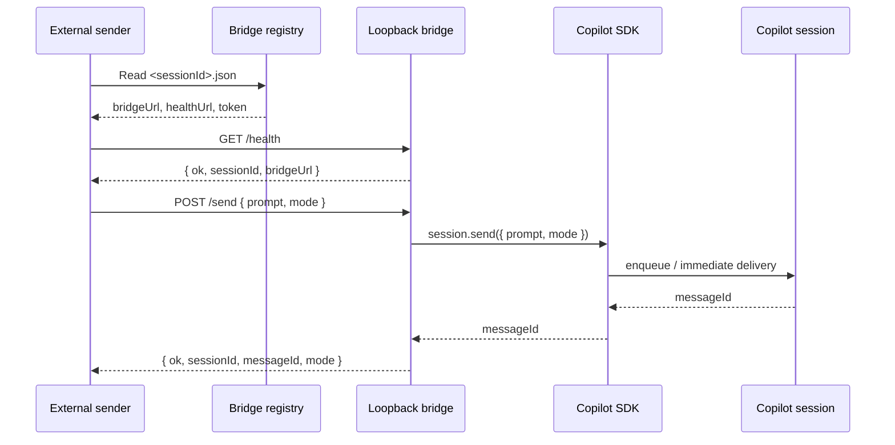
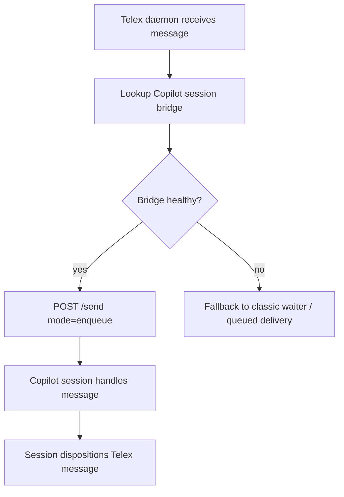

# Protocol

This document describes the automation contract for the `session-send-bridge` Copilot CLI extension.

## Flow



## Registry

Each bridge-enabled session writes:

```json
{
  "sessionId": "uuid",
  "bridgeUrl": "http://127.0.0.1:12345/send",
  "healthUrl": "http://127.0.0.1:12345/health",
  "token": "secret",
  "pid": 12345,
  "createdAt": "2026-06-30T00:00:00.000Z"
}
```

Default registry directory:

```text
~/.copilot/session-send-bridge/
```

## Health request

```http
GET /health
```

Response:

```json
{
  "ok": true,
  "sessionId": "uuid",
  "bridgeUrl": "http://127.0.0.1:12345/send"
}
```

## Send request

```http
POST /send
Authorization: Bearer <token>
Content-Type: application/json
```

Body:

```json
{
  "prompt": "message text",
  "mode": "enqueue"
}
```

`mode`:

| Mode | Behavior |
|---|---|
| `enqueue` | Add message to the session queue. |
| `immediate` | Interject during the active turn. |

## Send response

```json
{
  "ok": true,
  "sessionId": "uuid",
  "messageId": "uuid",
  "mode": "enqueue"
}
```

Errors:

```json
{ "ok": false, "error": "unauthorized" }
{ "ok": false, "error": "prompt_required" }
{ "ok": false, "error": "not_found" }
```

## Telex envelope suggestion

```text
[TELEX_MESSAGE v1]
message_id: <id>
from: <address>
to: <address>
subject: <subject>
attention: background|next-checkpoint|interrupt
requires_disposition: true|false

<body>

required_action:
- handle this message
- disposition message_id via telex ack/handle/defer/reject/etc.
[/TELEX_MESSAGE]
```

## Telex delivery


